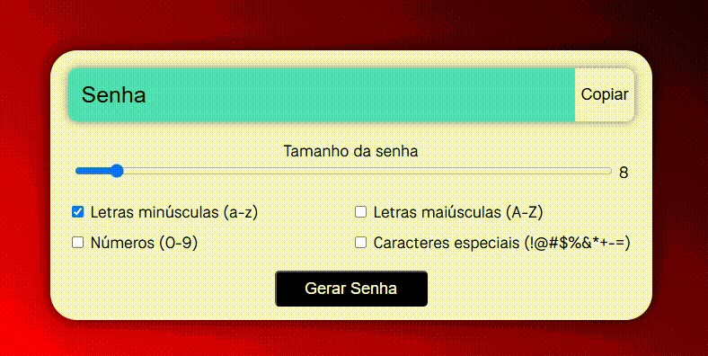

# 🔐 Gerador de Senhas

Este é um gerador de senhas simples que permite gerar senhas seguras com diferentes tipos de caracteres e tamanhos, além de copiar com um clique.

## 📷 Preview



## 🚀 Funcionalidades

- Definir o comprimento da senha (entre 4 e 64 caracteres)
- Incluir:
  - Letras minúsculas
  - Letras maiúsculas
  - Números
  - Caracteres especiais
- Copiar a senha gerada com um clique

## 🛠️ Tecnologias utilizadas

- HTML5
- CSS3
- JavaScript (puro)

## 📌 Observações

- O botão "Copiar" utiliza a API `navigator.clipboard` e pode não funcionar em navegadores antigos sem HTTPS.
- Estilo visual moderno com gradiente de fundo e sombreamento nos elementos.

## ▶️ Como Usar

Entre no site: [Gerador de Senhas](https://gerador-de-senhas-efrals.netlify.app)

OU

1. Clone este repositório:

   ```bash
   git clone https://github.com/Efrals/gerador-de-senhas.git
   ```

2. Navegue até a pasta do projeto

3. Abra o arquivo `index.html` em seu navegador.
